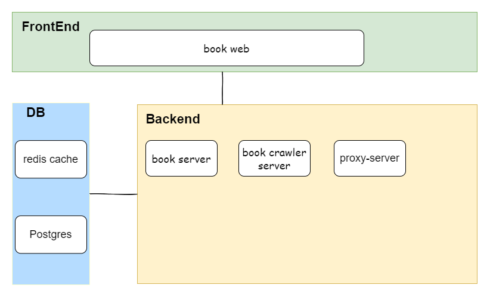

# BookShop-go

> 書店的後端服務，提供API給前端，以go + redis + postgres組成。

### Features

* 提供API服務
* 使用session認證帳號

### Architecture



### Installation

#### [Recommand]Install with docker and run

##### Step1: Start the Proxy Server instance

``` bash
# download proxy server
git clone https://github.com/tsukiamaoto/proxy-server-go.git

cd proxy-server-go
# run with docker
docker-compose up -d
```

##### Step2: Start the Book Crawler instance

``` bash
# download book crawler
git clone https://github.com/tsukiamaoto/book-crawler-go.git

cd book-crawler-go

# run with docker
docker-compose up -d
```

##### Step3: Start BookShop instance

``` bash
# download book crawler
git clone https://github.com/tsukiamaoto/bookShop-go.git

cd bookShop-go

# run with docker
docker-compose up -d
```

#### Install from source and run

##### Step1: Install redis server

資料會暫存在redis裡面，需要先啟動redis server。

照著在[!redis document](https://redis.io/docs/getting-started/installation/)的文件安裝，然後啟動redis server。

##### Step2: Install postgresql server

資料會存放在postgresql資料庫裡，一定要安裝。
在[!postgresql document](https://www.postgresql.org/download/)下載，並安裝

修改在/book-crawler-go/db/database.go程式碼，改成以下內容

``` go
func DbConnect(conf *config.COnfig) *gorm.DB {
  postgresDB, err := gorm.Open(postgres.Open(conf.Databases["default"].Source))
  if err != nil {
    fmt.Println("使用 gorm 連線 DB 發生錯誤，原因為", err)
    log.Error(err)
    return nil, hasCreatedDB
  }

  dbExec := fmt.Sprintf("CREATE DATABASE %s;", conf.Databases["shopCart"].Name)
  err = postgresDB.Exec(dbExec).Error
  if err == nil {
    hasCreatedDB = true
    fmt.Printf("建立 %s 資料庫\n", conf.Databases["shopCart"].Name)
  } else {
    fmt.Printf("%s 資料庫已經建立，連線該資料庫\n", conf.Databases["shopCart"].Name)
  }

  conn, err := gorm.Open(postgres.Open(conf.Databases["shopCart"].Source))
  if err != nil {
    fmt.Println("使用 gorm 連線 DB 發生錯誤，原因為", err)
    log.Error(err)
    return nil
  }

  return conn
}

```

修改在/book-crawler-go/app.yaml設定，改成以下內容

對了，資料庫密碼要改成你設定的

``` yaml
application:
  port: 8080
  host: "localhost"
  uploadPath: "./upload"
  mode: "dev"
  apiBaseRoute: "/api"
  cors:
    allowOrigins: ["http://localhost:3000"]
  
databases:
  shopCart:
    host: "localhost"
    port: 5432
    user: "test"
    password: "your_password"
    dbname: "shop_cart"
  
  default:
    host: "localhost"
    port: 5432
    user: "postgres"
    password: "your_password"
    dbname: "postgres"
```

##### Step3: Install BookShop

``` bash
# download file
git clone https://github.com/tsukiamaoto/bookShop-go.git

cd /bookShop-go

# run
go run main.go
```

### TODO

- [x] Docker部署
- [ ] 全部資料redis快取緩存
